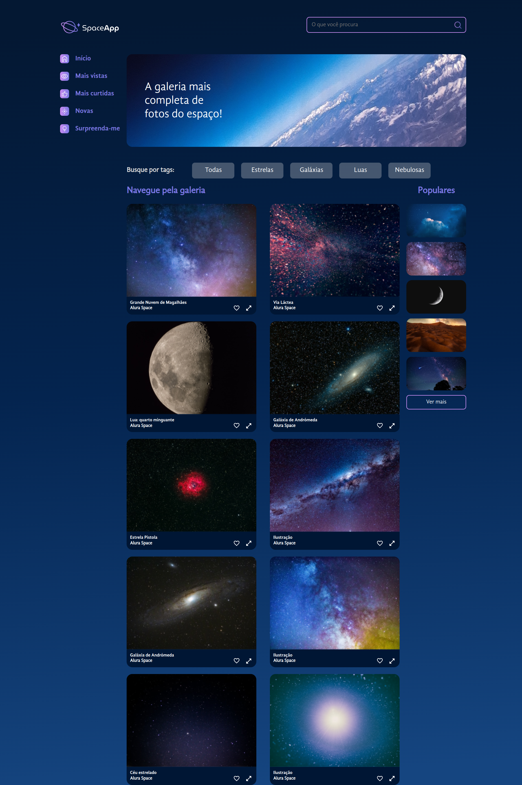
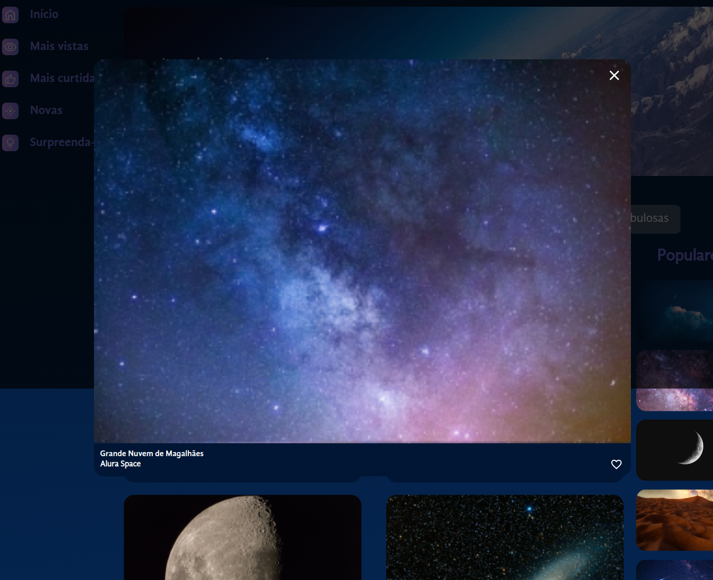
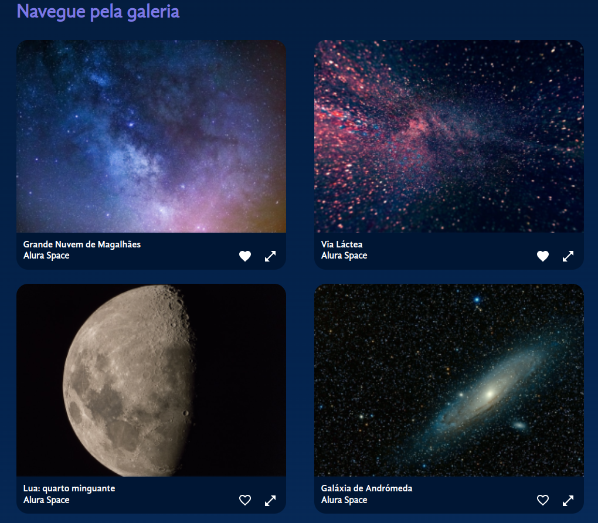

# AluraFlix - Cadastro de Cards

Este projeto tem como foco a prática do uso do Styled Components com React e Vite. Ele exibe imagens pré-definidas de galáxias, permitindo que os usuários ampliem as imagens em um modal e marquem suas galáxias favoritas.

## :dizzy: Tecnologias utilizadas

<div>
  
  
  
  
  
</div>

## :hammer: Funcionalidades

- Visualização de Galáxias: Exibe uma coleção de imagens de galáxias.
- Modal de Zoom: Permite ampliar a imagem em um modal utilizando a tag <dialog> do JavaScript.
- Favoritar Galáxias: Permite aos usuários marcar suas galáxias favoritas.

## :camera_flash: Capturas de Tela

### Página Inicial



### ModalZoom


### Imagens Favoritadas



## :globe_with_meridians: Acesso ao Deploy do projeto

### Github Page

O projeto está disponível no Github Page. Você pode acessá-lo através do seguinte link: 

clique aqui: [SpaceApp ](https://charlesbrcosta.github.io/SpaceApp/)

## :warning: Instalação

### :dvd: Passo a Passo

1. Clone o repositório:

   ```bash
   git clone https://github.com/charlesbrcosta/SpaceApp.git
   cd SpaceApp

2. Instale as dependências:
    ```bash
    npm install ou npm i

3. Inicie o servidor de desenvolvimento:
    ```bash
    npm run dev

## :mag_right: Uso do ModalZoom

O componente de modal para zoom foi implementado utilizando a tag `<dialog>` do JavaScript. Aqui está um exemplo tag:

```js
<dialog open>
<p>Greetings, one and all!</p>
<form method="dialog">
    <button>OK</button>
</form>
</dialog>
```

Aqui está um exemplo da tag `<dialog>` aplicada ao projeto:

```js
export const ModalZoom = ({ photo, close, toggleFavorite }) => {
    return (
        <>
            {photo && <>
            <Overlay />
                <StyledDialog open={!!photo} onClose={close}>
                    <Image photo={photo} expanded={true} toggleFavorite={toggleFavorite}/>
                    <form method="dialog">
                        <ButtonIcon>
                            
                        </ButtonIcon>
                    </form>
                </StyledDialog>
            </>}
        </>
    );
}
```
## :handshake: Contribuição

Se você quiser contribuir com o projeto, siga os passos abaixo:

    Faça um fork deste repositório.
    Crie uma nova branch (git checkout -b feature/nova-feature).
    Faça commit das suas alterações (git commit -am 'Adiciona nova feature').
    Faça push para a branch (git push origin feature/nova-feature).
    Abra um Pull Request.

## :student: Autor

[<br><sub>Charles Bruno</sub>](https://github.com/charlesbrcosta)


## :page_facing_up: Licença

Este projeto está licenciado sob a [Licença MIT](https://www.mit.edu/~amini/LICENSE.md).